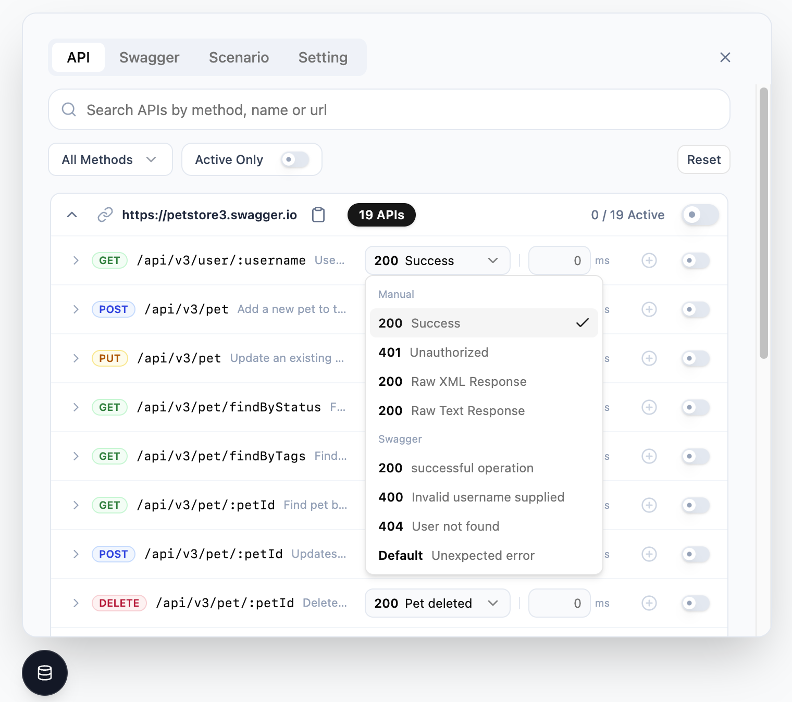

# Mocking GUI

<section align="center">
  <h3>Intuitive Mock Service Worker (MSW) Management GUI</h3>
  <p>
    Manage API mocks, simulate complex scenarios, and accelerate development with a powerful GUI.
  </p>
  <a href="https://kakaoenterprise.github.io/mocking-gui">
    
  </a>
  <a href="https://www.npmjs.com/package/@kakaocloud/mocking-gui">
    
  </a>
  <a href="LICENSE">
    
  </a>
</section>

<br />

<div align="center">
  
</div>

<br />

## Why Mocking GUI?

Mocking GUI supercharges your development workflow by adding a visual layer to **MSW (Mock Service Worker)**. No more code changes to switch mock scenarios or network responses.

- **Visual Control**: Toggle handlers and switch response variants instantly via the GUI.
- **Scenario Management**: Capture complex bug reproduction steps as "Scenarios" and share them with your team.
- **Swagger Integration**: Generate mocks automatically from OpenAPI/Swagger documents.

## Quick Start

### Installation

```bash
pnpm add @kakaocloud/mocking-gui
# or
npm install @kakaocloud/mocking-gui
# or
yarn add @kakaocloud/mocking-gui
```

### Setup

1. **Initialize MSW** (if you haven't already)

```bash
npx msw init <PUBLIC_DIR>
```

2. **Add the Mocking GUI Panel**

Simply render `MockingGUIBoundary` in your root component:

```tsx
// src/App.tsx
import { MockingGUIBoundary } from '@kakaocloud/mocking-gui/browser';

function App() {
  return (
    <>
      {/* Conditionally render Mocking GUI Panel only in development */}
      {process.env.NODE_ENV === 'development' ? (
        <MockingGUIBoundary>
          <AppContent />
        </MockingGUIBoundary>
      ) : (
        <AppContent />
      )}
    </>
  );
}
```

## Examples

Explore our ready-to-run examples to see it in action:

| Project                                           | Description                               |
| :------------------------------------------------ | :---------------------------------------- |
| [**next-app-router**](./examples/next-app-router) | Next.js App Router integration (RSC, CSR) |
| [**react-csr**](./examples/react-csr)             | Basic React Example (CSR)                 |

## Documentation

For comprehensive guides and API references, visit our [documentation site](https://kakaoenterprise.github.io/mocking-gui).

- [**Introduction**](https://kakaoenterprise.github.io/mocking-gui/guide/introduction)
- [**API Reference**](https://kakaoenterprise.github.io/mocking-gui/guide/usage/api-guide)
- [**AI Agentic Harness Guide**](./docs/guide/agentic-harness.md)
- [**Contributing Guide**](./CONTRIBUTING.md)

## AI Agentic Harness

Mocking GUI is developed and maintained with the help of a specialized AI agent team. You can leverage these workflows and skills to accelerate your development or integration process.

### Mission Map: Workflow Selection

Select a mission that aligns with your context and request it via your **AI coding assistant**.

| Your Context                     | Mission Request               | Outcome                                            |
| :------------------------------- | :---------------------------- | :------------------------------------------------- |
| **Enhancing Library Core/UI**    | `/harness-dev-pipeline`       | Full Design-Dev-Test pipeline orchestration        |
| **Project Adoption & Migration** | `/technical-solution-support` | Context-aware adoption strategy and migration plan |

### Knowledge Entry Points

Leverage specialized skills for precise assistance in specific domains:

- **[Handler Generation](./.agents/skills/handler-generation/SKILL.md)**: Automate handler creation from API specifications.
- **[Core Knowledge](./.agents/skills/harness-core/SKILL.md)**: Deep-dive into library architecture and state synchronization.
- **[Scenario Orchestration](./.agents/skills/scenario-orchestration/SKILL.md)**: Design complex multi-API business flows.
- **[Technical Guardrail](./.agents/skills/technical-guardrail/SKILL.md)**: Audit project mocking structures against standards.

For more details on collaborating with our agents, see the **[AI Agentic Harness Guide](./docs/guide/agentic-harness.md)**.

## Contributing

We welcome contributions! Please see our [Contributing Guide](CONTRIBUTING.md) and [AI Agentic Harness Guide](docs/guide/agentic-harness.md) for details on how to get started.

## NOTICE

Please refer to [NOTICE.md](NOTICE.md) for important legal notices and third-party attribution information.

## License

This project is licensed under the [MIT License](LICENSE).

---

<div align="center">
  <sub>Built with ❤️ by <a href="https://github.com/kakaoenterprise">Kakao Enterprise Corp.</a></sub>
</div>
